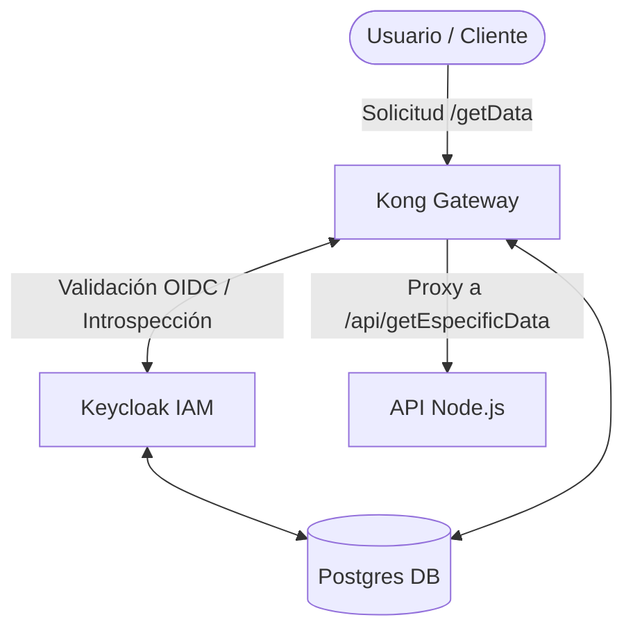

# API Gateway POC (Kong + Keycloak + Node.js)

Este proyecto es una Prueba de Concepto (POC) que demuestra la implementación de un **API Gateway** utilizando **Kong**, integrado con **Keycloak** para la gestión de identidades (IAM) y una **API Node.js** protegida.

## 🏗️ Arquitectura

La arquitectura se basa en microservicios orquestados con Docker Compose:



### Componentes:
- **Kong Gateway**: Actúa como el único punto de entrada. Utiliza el plugin `oidc` para validar que las peticiones tengan un token JWT válido antes de redirigirlas.
- **Keycloak**: Servidor de identidad que maneja el Realm `poc-realm`, clientes y usuarios.
- **API Node.js**: Un servicio simple que expone datos. Aunque está detrás de Kong, realiza una validación secundaria del JWT usando JWKS por seguridad "Zero Trust".
- **Postgres**: Base de datos compartida (en diferentes esquemas/DBs) para Keycloak y Kong.

## 🚀 Inicio Rápido

### Prerrequisitos
- Docker y Docker Compose instalados.

### Levantando el entorno
1. Clona el repositorio.
2. **Configuración del Host Local**: Para que la validación de tokens funcione correctamente entre tu máquina y el contenedor de Kong/API, debes añadir `keycloak` a tu archivo de hosts.
   - **Windows**: Ejecuta el Bloc de Notas como administrador y abre `C:\Windows\System32\drivers\etc\hosts`. Añade la siguiente línea al final:
     ```text
     127.0.0.1 keycloak
     ```
   - **Linux/macOS**: Edita `/etc/hosts` con privilegios de root (`sudo nano /etc/hosts`):
     ```text
     127.0.0.1 keycloak
     ```
3. Ejecuta el siguiente comando para levantar todos los servicios:
   ```bash
   docker-compose up -d --build
   ```
4. El sistema estará listo cuando todos los contenedores reporten estado `healthy` o `running`.

## 🔐 Flujo de Seguridad

1. **Autenticación**: El cliente obtiene un token JWT de Keycloak.
2. **Validación en Gateway**: Kong intercepta la petición en `/getData`, extrae el token y lo valida contra el endpoint de introspección de Keycloak.
3. **Propagación**: Si es válido, Kong redirige la petición a la API interna.
4. **Validación en API**: La API recibe el token, obtiene la clave pública de Keycloak (`jwks_uri`) y verifica la firma y el emisor (`issuer`) del token antes de responder con los datos.

## 🛠️ Uso y Endpoints

### Endpoints Expuestos (vía Kong)
- `GET http://localhost:8000/getData`: Endpoint protegido que requiere un Bearer Token.

### Endpoints de Administración (Locales)
- **Keycloak Admin**: [http://localhost:8080](http://localhost:8080) (Admin: `admin` / `admin`)
- **Kong Admin API**: [http://localhost:8001](http://localhost:8001)
- **Kong Manager (GUI)**: [http://localhost:8002](http://localhost:8002)

### Obtener Token de Keycloak (api-a)
```bash
curl -X POST "http://keycloak:8080/realms/poc-realm/protocol/openid-connect/token" \
     -H "Content-Type: application/x-www-form-urlencoded" \
     -d "client_id=api-a" \
     -d "client_secret=api-a-secret" \
     -d "grant_type=client_credentials"
```

### Obtener Token de Keycloak (api-b - No Autorizado)
```bash
curl -X POST "http://keycloak:8080/realms/poc-realm/protocol/openid-connect/token" \
     -H "Content-Type: application/x-www-form-urlencoded" \
     -d "client_id=api-b" \
     -d "client_secret=api-b-secret" \
     -d "grant_type=client_credentials"
```
*Si usas este token contra `/getData`, la API responderá con un **403 Forbidden**.*

### Ejemplo de Prueba con cURL (A través de Kong)
Una vez tengas el token, puedes llamar a la API:

```bash
curl -H "Authorization: Bearer <TU_TOKEN_AQUÍ>" http://localhost:8000/getData
```

## ⚙️ Configuración Relevante

- **Seguridad Multi-cliente**: La API valida el campo `azp` (Authorized Party) del token. Si un token fue emitido para `api-b`, la `api-a` lo rechazará aunque la firma sea válida.

- **Modo Base de Datos**: Kong está configurado para usar Postgres. A diferencia del modo DB-less, la configuración no se carga automáticamente al iniciar Kong.
- **Importación Automática**: He añadido un servicio `kong-config-import` en el `docker-compose.yml` que ejecuta `kong config db_import` para cargar tu archivo `kong.yml` en la base de datos cada vez que levantas el entorno.
- **Kong Plugin OIDC**: Configurado para el cliente `api-a` con autenticación `bearer_only`.
- **Keycloak Realm**: Se importa automáticamente al iniciar desde `./keycloak/realm-export.json`.
- **API Node.js**: Escucha en el puerto 3000 internamente y valida tokens contra `http://keycloak:8080`.
